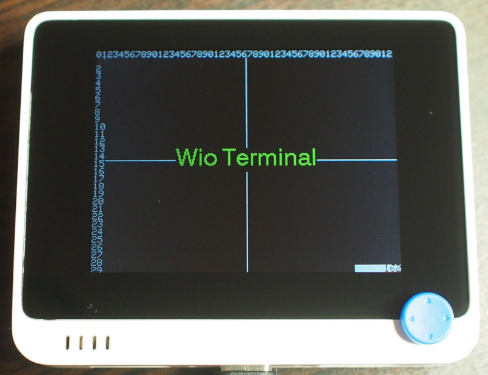

# Sample Sketch for Wio Terminal

## 動作確認環境

* Arduino IDE 1.8.13
* [Seeed SAMD Boards](https://github.com/Seeed-Studio/ArduinoCore-samd) 1.7.9

## サンプルスケッチ

### ボタン

|スケッチ名|概要|追加ライブラリ|
|:--|:--|:--|
|button/button|表示されている数字をボタンでカウントアップします。 Aボタンで+1、Bボタンで+10、Cボタンで+100。|-|
|button/button-acebutton|表示されている数字をボタンでカウントアップ、リセットします。 Aボタンで+1、Bボタンで+10、Cボタンで+100。 Cボタン長押しでリセット。|[AceButton](https://github.com/bxparks/AceButton)|

### ディスプレイ

|スケッチ名|概要|追加ライブラリ|写真|
|:--|:--|:--|:--|
|display/draw-text|ディスプレイに文字を表示します。|-||
|display/draw-text-textfont|ディスプレイに文字を表示します。 （テキストフォントを指定）|-||

### Grove

|スケッチ名|概要|追加ライブラリ|写真|
|:--|:--|:--|:--|
|grove/GroveButton|ボタンの入力状態をシリアルモニタに表示します。|[GroveDriverPack](https://github.com/SeeedJP/GroveDriverPack)||
|grove/GroveBuzzer|1秒毎にブザーを鳴らします。|[GroveDriverPack](https://github.com/SeeedJP/GroveDriverPack)||
|grove/GroveRotaryAngle|ツマミ（ノブ）の回転角度をシリアルモニタに表示します。|[GroveDriverPack](https://github.com/SeeedJP/GroveDriverPack)||
|grove/GroveAccelerometer16G|加速度をシリアルモニタに表示します。|[GroveDriverPack](https://github.com/SeeedJP/GroveDriverPack)||

### ネットワーク

> Wio Terminal に載っている通信モジュールRTL8720DNのファームウェアを最新にする必要があります。  
> [seeed-ambd-sdk](https://github.com/Seeed-Studio/seeed-ambd-sdk)

|スケッチ名|概要|追加ライブラリ|
|:--|:--|:--|
|network/http-client||LIB1, [HttpClient](https://github.com/amcewen/HttpClient)|
|network/https-client||LIB1, [HttpClient](https://github.com/amcewen/HttpClient)|
|network/mqtt-client||LIB1, [Arduino Client for MQTT](https://github.com/knolleary/pubsubclient)|
|network/mqtts-client||LIB1, [Arduino Client for MQTT](https://github.com/knolleary/pubsubclient)|

## 追加ライブラリ

### LIB1

* [Seeed_Arduino_FreeRTOS](https://github.com/Seeed-Studio/Seeed_Arduino_FreeRTOS)
* [esp-at-lib](https://github.com/Seeed-Studio/esp-at-lib)
* [Seeed_Arduino_atUnified](https://github.com/Seeed-Studio/Seeed_Arduino_atUnified)
* [Seeed_Arduino_atWiFi](https://github.com/Seeed-Studio/Seeed_Arduino_atWiFi)
* [Seeed_Arduino_mbedtls](https://github.com/Seeed-Studio/Seeed_Arduino_mbedtls)
* [Seeed_Arduino_atWiFiClientSecure](https://github.com/Seeed-Studio/Seeed_Arduino_atWiFiClientSecure)
